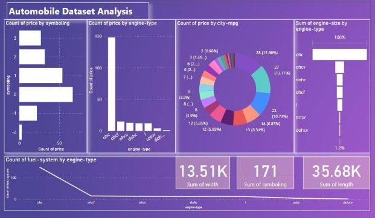
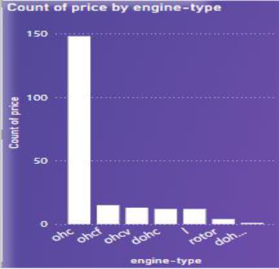
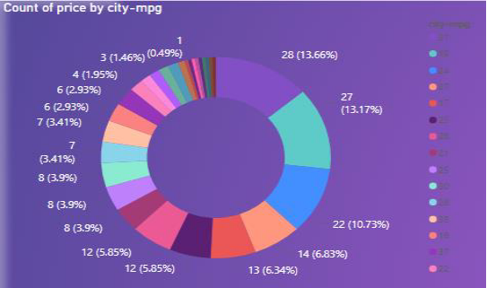
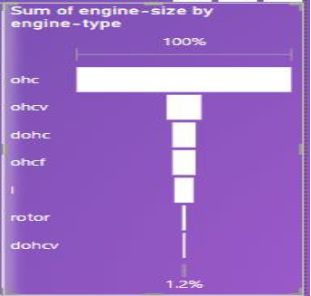
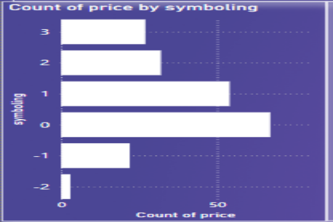
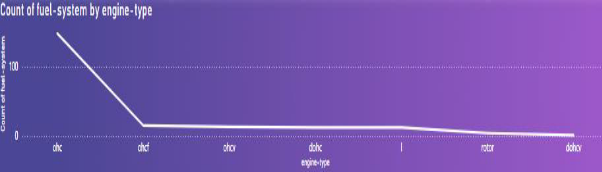

**
AUTOMOBILE DATASET ANALYSIS
**

`                                                
 Presented by- Tejas Langhe 

 

                           **DASHBOARD BASED ON AUTOMOBILE DATASET** 

**Data Exploration :** 

In Automobile dataset, there are different information about automobile data like aspiration ,body style , bore. We have the engine type ,engine size , engine location fuel type ,fuel size. We have different types of wheels, horse power ,height ,price ,symbols ,etc. We have the number of doors ,number of cylinders ,length, stroke    

**LIST OF PROBLEM STATEMENTS**  

1)Engine Price : 

Understand the market prices of vehicles engines. 

\2) City-mpg wise Market Price : 

Determine the market price of vehicle in city-mpg.  

3)Engine Size :   

` `Identify the size of the engine is important in this database .identify the size of each engine types  

4)Symbol Rate : 

Determine the symbolling of vehicle with respect to its price. 

\5) Fuel System Range : 

Identify the range of fuel system with respect to different engine type. 

**RESOLVING THE PROBLEMS BY USING CHARTS** 

1)Count of Engine price by engine type **Visualization** = Stacked Column Chart 

**Explaination**  = The chart will illustrate the different types of engine types over                         the prices. 

Engine type                                 Price 1.ohc                                             150 2.ohcf                                             10 3.ohcv                                              9 4.dohc                                              8 

This chart shows the prices of engine type such as ohc (150) ,ohcf (10) ,ohcv (9) , dohc (8) ,I (8) ,etc. 

2)Count of price by city-mpg. 

**Visualization** = Donut Chart

**Explaination**  = This chart will illustrate the city-mpg to price. It means(city-    mpg) score the car will get on average in city condition with stopping and starting at lower speed. 

City-mpg                                        Price 

1) 31                                                28(13.66 %) 
1) 19                                                27(13.17 %) 
1) 24                                                22(10.73 %) 

3)Sum of Engine size by Engine type 

**Visualization** = Funnel chart 

**Explaination** = This chart will illustrate the different sizes of engine over the different types of engine 

Engine Type                        Engine Size 1.ohc                                       100 % 2.ohcv                                       10 % 3.dohc                                         9 % 4.ohcf                                          9 % 

5\.i                                                 8 % 

4)Count of price by Symboling 

**Visualization** = Bar chart** 

**Explaination** = This chart will illustrate the price of different symbols 

Symboling                               Price 

1  54 2  30 3  25 

\5) Count of fuel system by Engine types 

**Visualization** = Line chart** 

**Explaination** = The Line chart will illustrate the fuel system ovet engine type 

In this chart shows the count of fuel system by engine type. Engine type over fuel system is ohc has more than 100 but remaining are lesser fuel systems such as ohcf ,ohcv ,dohc ,I ,rotor ,etc. 

[ref1]: Aspose.Words.d6bb2b07-2510-4502-983f-60427aecc4ce.001.png

